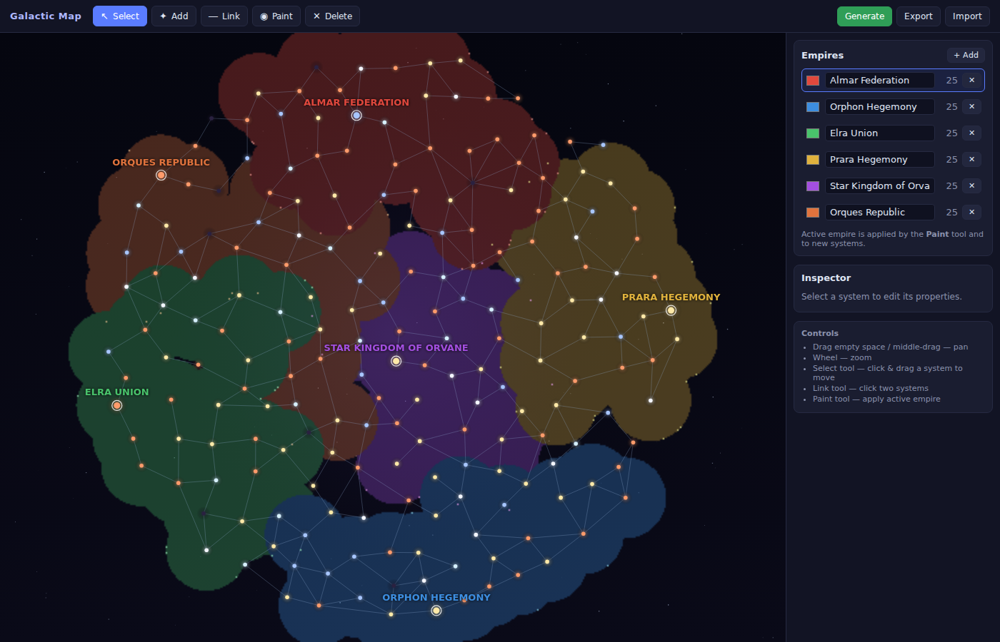

# Galactic Map — Political Map Editor

A browser-based tool to **generate and edit** a political map of a galaxy, in the
style of Stellaris: star systems linked by hyperlanes, grouped into empires whose
territory is drawn as organic, glowing "blob" borders.



## Features

- **Procedural generation** — spiral / elliptical / ring galaxy shapes, tunable
  system count, empire count, spiral arms, and seed (deterministic: same seed →
  same galaxy).
- **Organic territory borders** — Stellaris-style blobs rendered with a metaball
  technique: each owned system contributes a soft influence field that is
  thresholded so an empire's systems merge into one smooth shape with a bright rim.
- **Editing tools**
  - **Select** — click/drag systems to move them; edit properties in the Inspector.
  - **Add** — drop a new star system (assigned to the active empire).
  - **Link** — click two systems to toggle a hyperlane.
  - **Paint** — assign systems to the active empire (click or drag).
  - **Delete** — remove a system.
- **Empire panel** — add/remove empires, edit name and colour, see system counts,
  pick the active empire.
- **Inspector** — edit a system's name, star type, owner, influence radius, and
  set it as its empire's capital.
- **Persistence** — export/import the map as JSON; automatic autosave to
  `localStorage` restored on reload.

## Getting started

```bash
npm install
npm run dev      # http://localhost:5173
npm run build    # type-check + production build to dist/
```

## Controls

| Action | How |
|---|---|
| Pan | drag empty space, or middle-mouse drag |
| Zoom | mouse wheel (zooms toward the cursor) |
| Move a system | Select tool, drag a system |
| New system | Add tool, click empty space |
| Hyperlane | Link tool, click two systems (again to remove) |
| Assign owner | Paint tool + active empire, click/drag systems |

## Architecture

```
src/
  model/        types + zustand store (the whole editable document)
  generation/   shapes → poisson sampling → delaunay graph → empire flood-fill → names
  render/       camera, metaball territories, canvas renderer (background/lanes/stars/labels)
  ui/           React chrome: canvas host, toolbar, empire panel, inspector, generate dialog
  persistence/  JSON import/export + localStorage autosave
  util/         seeded PRNG (mulberry32)
```

The map is a single serializable `GalaxyMap` object (`src/model/types.ts`); the
canvas subscribes to store changes and redraws on demand.

## Ideas for later (not in the MVP)

- Voronoi-clipped borders for crisp seams between adjacent empires.
- Undo/redo, PNG export, nebulae / wormholes as first-class objects.
- A light simulation mode (turns, empire expansion, conquest).
